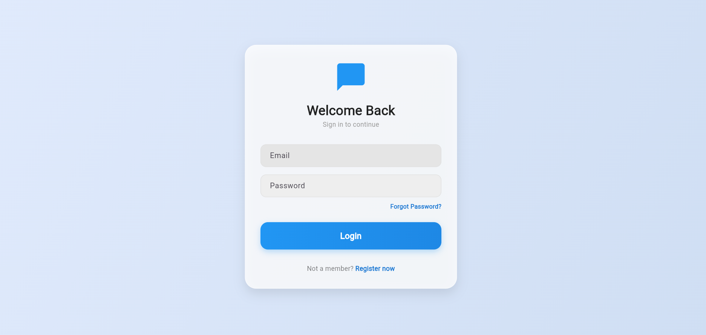
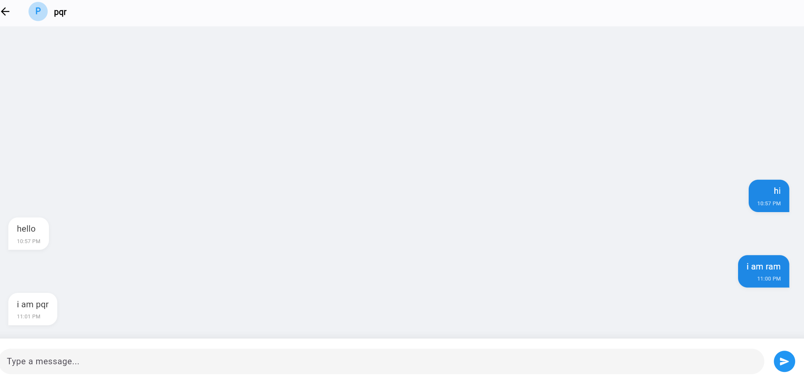
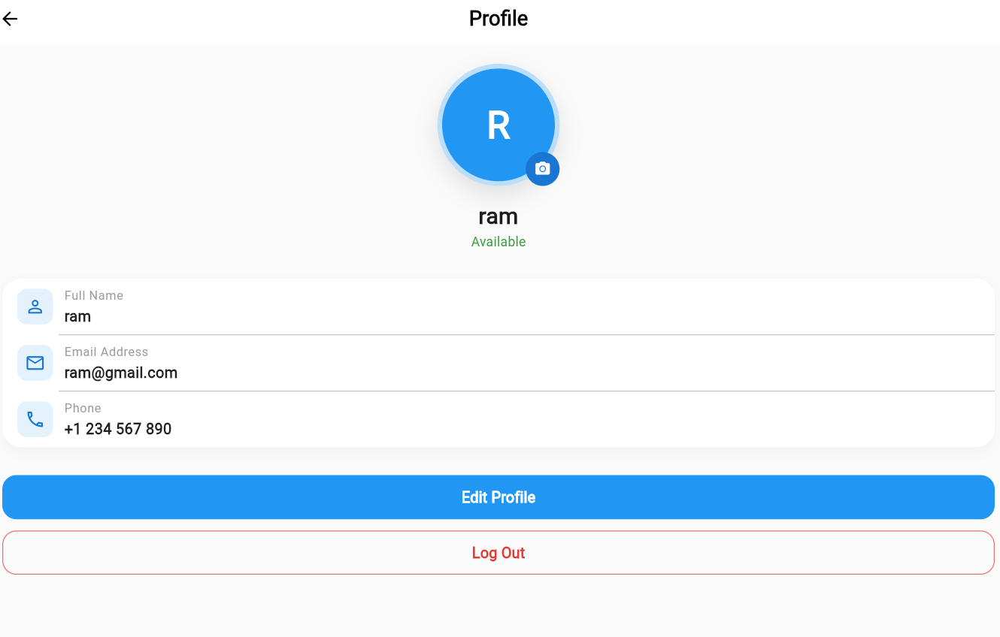

## 💬 Flutter Real-Time Chat App:
A modern, high-performance real-time chat application built with Flutter and Firebase.
This project demonstrates a clean architecture approach using the BLoC (Cubit) pattern, 
featuring real-time data syncing, user authentication, and a polished UI.

## ✨ Key Features
• Real-time Messaging: Messages appear instantly across devices using Firestore Streams.
• Secure Authentication: Email & Password login/signup powered by Firebase Auth.
• Smart Chat Rooms: Automated unique Chat ID generation with sorting logic to ensure persistent conversations between two users.
• User Search: Dynamic filtering of the user directory to find friends quickly.
• Professional UI:
◦ Modern "Messenger-style" chat bubbles with sender-specific alignment and colors.
◦ Responsive design for both Android and iOS.
◦ Clean Profile and Home screens.
• Architecture: Implemented using Flutter BLoC (Cubit) for state management and Repository Pattern for data handling.

## 🛠️ Tech Stack
• Frontend: Flutter (Dart)
• State Management: Flutter BLoC / Cubit
• Backend: Firebase
◦ Cloud Firestore: Real-time NoSQL database for messages and user data.
◦ Firebase Authentication: Secure user management.
• UI Helpers: intl for date formatting, google_fonts.

## 📂 Project Structure
lib/
├── features/
│   ├── auth/
│   │   ├── data/          # Repositories and Models
│   │   ├── domain/        # Entities and Abstract Repos
│   │   └── presentation/  # Cubits and UI Pages
└── main.dart              # Entry point

## 📸 Screenshots

  
  
  

### 👨‍💻 Author
**Prasannata Baniya**

